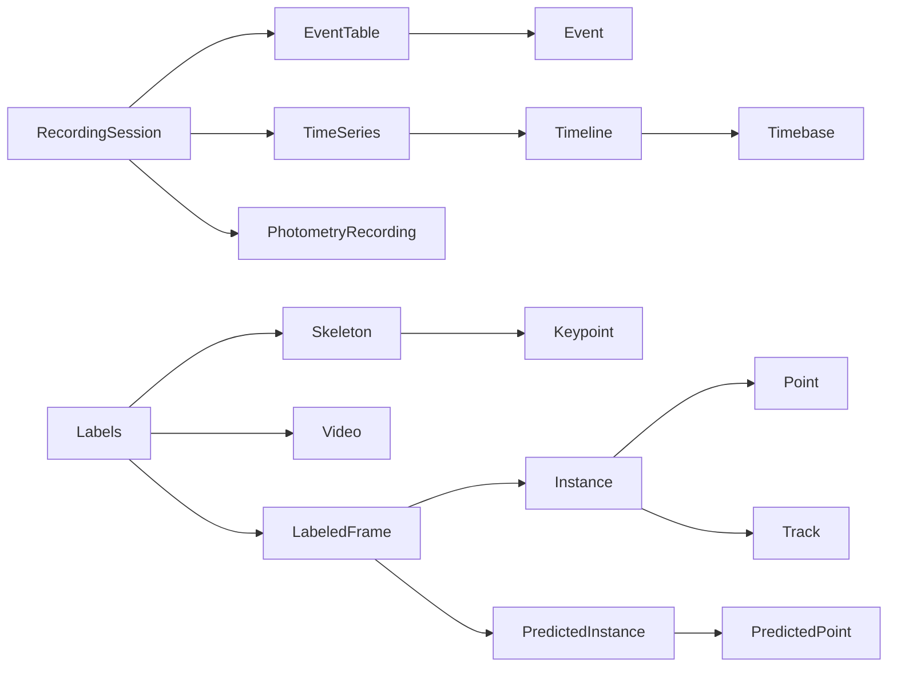

# Model

<div class="page-intro">
<p>
<code>xpkg.model</code> holds the canonical in-memory objects used across the
library: pose labels, media, Vicon payloads, sampled signals, events, and the
session/time primitives that keep modalities aligned.
</p>
</div>

## Object Graph



## Overview

<div class="panel-grid panel-grid-3" markdown="1">

<div class="surface-card" markdown="1">
<div class="surface-kicker">SESSION</div>
`RecordingSession`, `Timeline`, `EventTable`, and `TimeSeries` provide the
shared timing contract for multimodal experiment data.
</div>

<div class="surface-card" markdown="1">
<div class="surface-kicker">SCHEMA</div>
`Skeleton`, `Keypoint`, and `Track` define what a pose means and how identity is
carried across frames.
</div>

<div class="surface-card" markdown="1">
<div class="surface-kicker">ANNOTATION</div>
`LabeledFrame`, `Instance`, and `PredictedInstance` hold frame-level human and
model outputs.
</div>

<div class="surface-card" markdown="1">
<div class="surface-kicker">MEDIA</div>
`Video` and `SuggestionFrame` connect annotations to image and video sources.
</div>

</div>

## Core Types

### Top-level container

- `Labels` is the main dataset container. It owns labeled frames, videos,
  skeletons, tracks, suggestions, preferences, and session metadata.
- `RecordingSession` is the emerging multimodal session container. It groups
  pose, video, signals, and events without making xpkg an analysis framework.

### Timing, events, and signals

- `Timebase`, `Timeline`, and `TimeRange` define shared time coordinates.
- `Event`, `SyncEvent`, and `EventTable` represent behavior and synchronization
  markers on those timelines.
- `SignalChannel`, `TimeSeries`, `PhotometryChannel`, and
  `PhotometryRecording` represent sampled signals such as fiber photometry.

```python
from xpkg.model import Event, EventTable, PhotometryRecording, RecordingSession, TimeSeries

series = TimeSeries.from_samples(
    [[1.0, 0.5], [1.1, 0.48], [1.2, 0.47]],
    sample_rate_hz=20.0,
    channel_names=["gcamp", "isosbestic"],
    units=["dff", "dff"],
    name="fiber",
)
photometry = PhotometryRecording(
    series=series,
    signal_channel="gcamp",
    reference_channel="isosbestic",
)
events = EventTable.from_events(
    [Event(kind="trial", start_s=0.0, duration_s=1.0)]
)

session = RecordingSession(session_id="session-001")
session = session.with_signal("fiber", photometry).with_events(events)
```

These objects are direct model primitives today. `xpkg.readers.read_photometry_csv`,
`xpkg.readers.read_events_csv`, `xpkg.readers.read_pyphotometry_ppd`,
`xpkg.readers.read_pyphotometry_csv`, `xpkg.readers.read_rwd_ofrs_session`,
`xpkg.readers.read_neurophotometrics_csv`, `xpkg.readers.read_doric_photometry`,
`xpkg.readers.read_teleopto_h5`, `xpkg.readers.read_tdt_photometry_block`, and
the pMAT CSV readers are direct APIs on top of this model. Sync readers and
project imports are planned next; see
[Multimodal Session Model](../architecture/multimodal-session.md).

### Geometry and identity

- `Skeleton` defines the keypoints and links for one pose schema.
- `Keypoint` describes one named keypoint.
- `Track` identifies a tracked entity across frames.

### Per-frame annotations

- `LabeledFrame` binds a video and frame index to its instances.
- `Instance` stores user or ground-truth keypoints.
- `PredictedInstance` stores predicted keypoints and scores.

### Point primitives

- `Point` is the basic labeled point type.
- `PredictedPoint` adds prediction score information.
- `PointArray` and `PredictedPointArray` are the vectorized array forms.

### Media and suggestions

- `Video` wraps file-backed videos and image sequences.
- `SuggestionFrame` represents a suggested frame to review or label.

## Creating a Skeleton

```python
from xpkg.model import build_keypoint_skeleton

skeleton = build_keypoint_skeleton(
    ["nose", "left_ear", "right_ear", "tail_base"],
    name="subject_topdown",
)
```

Use `build_keypoint_skeleton` when you just need a named list of keypoints and
no explicit links yet.

## Loading a Skeleton Definition

`xpkg.model` also exposes skeleton loading helpers:

- `load_skeleton`
- `load_skeleton_dlc`
- `load_skeleton_xpkg_json`
- `load_skeleton_sleap`
- `load_skeleton_ultralytics`

Example:

```python
from xpkg.model import load_skeleton

skeleton = load_skeleton("config.yaml")
print(skeleton.name)
print(skeleton.keypoint_names)
```

## Creating a Minimal Labels Archive

```python
from xpkg.model import (
    Labels,
    LabeledFrame,
    Instance,
    Point,
    Video,
    build_keypoint_skeleton,
)

skeleton = build_keypoint_skeleton(["nose", "tail_base"], name="subject")
video = Video.from_filename("session.mp4")

instance = Instance(
    skeleton=skeleton,
    init_points={
        "nose": Point(100.0, 50.0),
        "tail_base": Point(80.0, 120.0),
    },
)

frame = LabeledFrame(video=video, frame_idx=0, instances=[instance])
labels = Labels(labeled_frames=[frame], videos=[video], skeletons=[skeleton])
```
