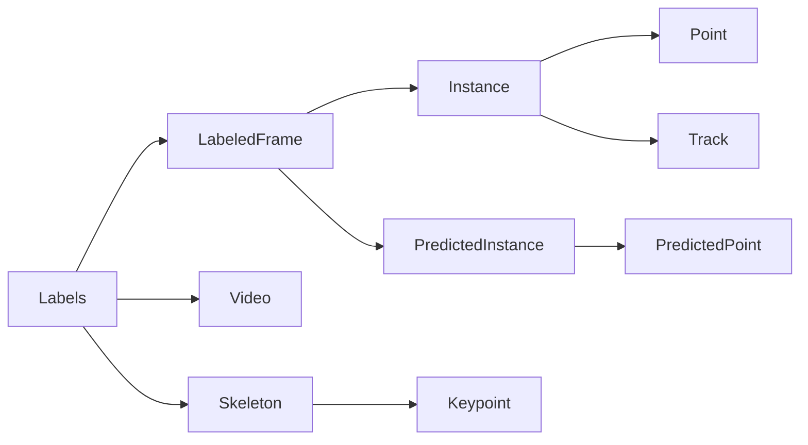

# Model

<div class="page-intro">
<p>
<code>xpkg.model</code> holds the pose-data objects used across the library.
If you are building tools on top of xpkg, this is usually the first module
to import.
</p>
</div>

## Object Graph



## Overview

<div class="panel-grid panel-grid-3" markdown="1">

<div class="surface-card" markdown="1">
<div class="surface-kicker">SCHEMA</div>
`Skeleton`, `Keypoint`, and `Track` define what a pose means and how identity is
carried across frames.
</div>

<div class="surface-card" markdown="1">
<div class="surface-kicker">ANNOTATION</div>
`LabeledFrame`, `Instance`, and `PredictedInstance` hold frame-level human and
model outputs.
</div>

<div class="surface-card" markdown="1">
<div class="surface-kicker">MEDIA</div>
`Video` and `SuggestionFrame` connect annotations to image and video sources.
</div>

</div>

## Core Types

### Top-level container

- `Labels` is the main dataset container. It owns labeled frames, videos,
  skeletons, tracks, suggestions, preferences, and session metadata.

### Geometry and identity

- `Skeleton` defines the keypoints and links for one pose schema.
- `Keypoint` describes one named keypoint.
- `Track` identifies a tracked entity across frames.

### Per-frame annotations

- `LabeledFrame` binds a video and frame index to its instances.
- `Instance` stores user or ground-truth keypoints.
- `PredictedInstance` stores predicted keypoints and scores.

### Point primitives

- `Point` is the basic labeled point type.
- `PredictedPoint` adds prediction score information.
- `PointArray` and `PredictedPointArray` are the vectorized array forms.

### Media and suggestions

- `Video` wraps file-backed videos and image sequences.
- `SuggestionFrame` represents a suggested frame to review or label.

## Creating a Skeleton

```python
from xpkg.model import build_keypoint_skeleton

skeleton = build_keypoint_skeleton(
    ["nose", "left_ear", "right_ear", "tail_base"],
    name="mouse_topdown",
)
```

Use `build_keypoint_skeleton` when you just need a named list of keypoints and
no explicit links yet.

## Loading a Skeleton Definition

`xpkg.model` also exposes skeleton loading helpers:

- `load_skeleton`
- `load_skeleton_dlc`
- `load_skeleton_xpkg_json`
- `load_skeleton_archive_json`
- `load_skeleton_sleap`
- `load_skeleton_ultralytics`

Example:

```python
from xpkg.model import load_skeleton

skeleton = load_skeleton("config.yaml")
print(skeleton.name)
print(skeleton.keypoint_names)
```

## Creating a Minimal Labels Archive

```python
from xpkg.model import (
    Labels,
    LabeledFrame,
    Instance,
    Point,
    Video,
    build_keypoint_skeleton,
)

skeleton = build_keypoint_skeleton(["nose", "tail_base"], name="mouse")
video = Video.from_filename("session.mp4")

instance = Instance(
    skeleton=skeleton,
    init_points={
        "nose": Point(100.0, 50.0),
        "tail_base": Point(80.0, 120.0),
    },
)

frame = LabeledFrame(video=video, frame_idx=0, instances=[instance])
labels = Labels(labeled_frames=[frame], videos=[video], skeletons=[skeleton])
```
