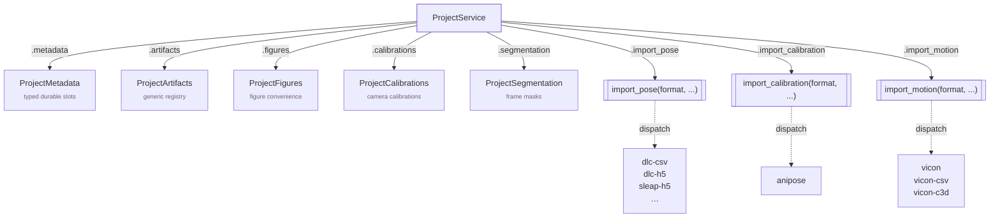
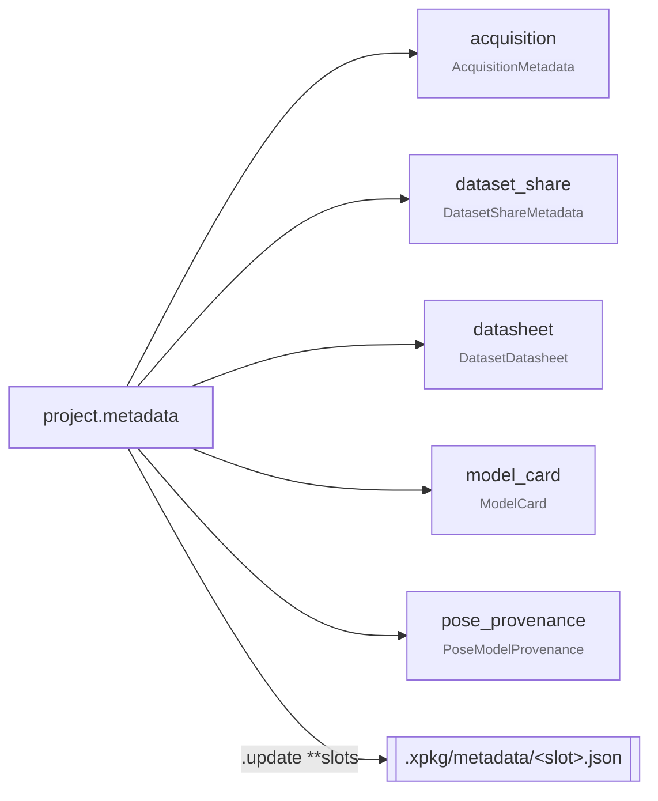

# Services

`xpkg.services` is the normal downstream API for xpkg projects. Start here
when you want one consumer-facing object that can create, open, import into,
validate, pack, or unpack a project-first project.

## ProjectService at a glance



The dispatch methods select package-owned importer implementations by a
kebab-case ``format`` string typed as `PoseFormat`, `CalibrationFormat`, or
`MotionFormat`.

## Metadata accessor



Each slot is read as a property and written via `project.metadata.update(...)`.
Slots provided as `None` are not touched; the call returns a `dict[str, Path]`
of slots actually written.

## Start here

- Use <code>ProjectService</code> as the stable consumer contract for project
  lifecycle operations.
- Use <code>project.import_pose(format, ...)</code>,
  <code>project.import_calibration(format, ...)</code>, and
  <code>project.import_motion(format, ...)</code> when you want the supported
  external importers without dropping out of that service object.
- Use <code>project.artifacts.*</code> when you want to register figures,
  tables, analyses, reports, stats, or other output files with portable
  manifests and a project-wide index.
- Use <code>project.figures.*</code> when you want to save figure outputs
  with portable provenance manifests. This is a convenience layer over the
  generic artifact registry.
- Use <code>project.segmentation.*</code> when you want to save or load
  frame-level segmentation masks without manually rebuilding a
  <code>Labels</code> object.

## Recommended Flow

```python
from xpkg.services import ProjectService

project = ProjectService.create("./My Project", title="My Project")
project.import_pose(
    "dlc-csv",
    path="tracking.csv",
    video="video.mp4",
    skeleton_name="subject",
)
project.validate()
artifact = project.pack()
restored = ProjectService.unpack(artifact, "./Restored Project")
```

This is the canonical downstream path:

- create or open a project
- import through <code>project.import_pose(...)</code>,
  <code>project.import_calibration(...)</code>, or
  <code>project.import_motion(...)</code>
- validate the managed project state
- pack only when you want a portable <code>.expkg</code> artifact
- reopen with <code>ProjectService.open(...)</code> or
  <code>ProjectService.unpack(...)</code> as needed

`project.pack()` defaults to `media="full"`. Pass `media="package"` to store
package-sized media while manifesting video containers, or `media="manifest"`
to record managed media without storing media bytes.

## Lifecycle Surface

`ProjectService` keeps the normal project-first project lifecycle on one
object:

- `ProjectService.create(...)`
- `ProjectService.open(...)`
- `ProjectService.unpack(...)`
- `project.describe()`
- `project.validate()`
- `project.load_labels()`
- `project.metadata.acquisition` / `dataset_share` / `pose_provenance` / `datasheet` / `model_card` (typed durable slots)
- `project.metadata.update(...)` (write one or more typed slots)
- `project.load_state_metadata()` (free-form dict on the current state head)
- `project.load_state_metadata_field(...)`
- `project.save_labels(...)`
- `project.save_state_metadata(...)`
- `project.save_state_metadata_field(...)`
- `project.artifacts.register(...)`
- `project.artifacts.load(...)`
- `project.artifacts.list(...)`
- `project.artifacts.index(...)`
- `project.artifacts.validate(...)`
- `project.figures.save(...)`
- `project.figures.load(...)`
- `project.figures.list(...)`
- `project.segmentation.save_masks(...)`
- `project.segmentation.load_masks(...)`
- `project.segmentation.load_frames(...)`
- `project.pack(...)`

`project.describe()` and `project.validate()` return a `ProjectLayout` with
the normalized managed paths, descriptor, and generated project summary index.
The summary index is shallow: it reports state kind, state bytes, modalities,
typed metadata slots, and artifact counts without loading labels, predictions,
or motion payloads.

For mapping-valued metadata blobs that callers update independently, prefer the
service-bound field helpers instead of rewriting the whole metadata payload.
These read and write the free-form ``metadata`` dict carried on the project
state head — distinct from the durable typed slots accessed via
``project.metadata``:

```python
from xpkg.services import ProjectService

project = ProjectService.open("./My Project")

project.save_state_metadata_field(
    "session_json",
    {"active_frame_idx": 7},
    reason="app.save.session_state",
)
session_state = project.load_state_metadata_field("session_json")
```

## Service-Bound Import Surface

Three dispatch methods on `ProjectService` cover all supported importers,
selecting a package-owned implementation by kebab-case ``format`` string:

| Service call | Format implementation |
| --- | --- |
| `project.import_pose("dlc-csv", path=..., video=...)` | DeepLabCut CSV |
| `project.import_pose("dlc-h5", path=..., video=...)` | DeepLabCut H5 |
| `project.import_pose("dlc-project", path=...)` | DeepLabCut project directory |
| `project.import_pose("lightning-pose-csv", path=..., video=...)` | Lightning Pose CSV |
| `project.import_pose("sleap-h5", path=..., video=...)` | SLEAP H5 |
| `project.import_pose("sleap-package", path=...)` | SLEAP package |
| `project.import_pose("mmpose-topdown-json", path=..., video=...)` | MMPose top-down JSON |
| `project.import_pose("mediapipe-pose-landmarks-json", path=..., video=...)` | MediaPipe pose landmarks JSON |
| `project.import_calibration("anipose", path=...)` | Anipose calibration TOML |
| `project.import_calibration("opencv-stereo-yaml", path=...)` | OpenCV stereo calibration YAML |
| `project.import_motion("vicon", path=...)` | Vicon auto-detect |
| `project.import_motion("vicon-csv", path=...)` | Vicon CSV |
| `project.import_motion("vicon-c3d", path=...)` | Vicon C3D |

The service dispatch is the public path for new project-facing code.

## Multimodal Reader And Import Plan

The session/time/events/signals model layer is public. Direct
fiber-photometry, event, and behavior readers are available now:

```python
from xpkg import readers

readers.read_photometry_csv(...)
readers.read_events_csv(...)
readers.read_pyphotometry_ppd(...)
readers.read_pyphotometry_csv(...)
readers.read_pmat_photometry_csv(...)
readers.read_pmat_events_csv(...)
readers.read_rwd_ofrs_session(...)
readers.read_neurophotometrics_csv(...)
readers.read_doric_photometry(...)
readers.read_teleopto_h5(...)
readers.read_tdt_photometry_block(...)
readers.read_behavior_events_csv(...)
readers.read_behavior_events_json(...)
readers.read_boris_csv(...)
readers.read_simba_csv(...)
readers.read_keypoint_moseq_syllables_csv(...)
```

Service-bound dispatch for these signal kinds is not implemented yet (planned
under a future ``project.import_signals(format, ...)``):

```python
# planned
project.import_signals("photometry-csv", path=...)
project.import_signals("events-csv", path=...)
project.import_signals("sync-csv", path=...)
```

The remaining direct reader planned in this family is:

```python
readers.read_sync_csv(...)
```

The fiber-photometry surface intentionally excludes imaging/miniscope and
electrophysiology formats such as Inscopix `.isx`, Blackrock NEV/NSx, and
Neuralynx Cheetah. Those belong to separate IO layers.

See [Multimodal Session Model](../architecture/multimodal-session.md) for the
model objects that will back those imports and [Roadmap](../roadmap.md) for the
implementation order.

## Generic Artifact Registry

`project.artifacts` is the first-class output registry for scientific
packages that build on xpkg. It records files and lineage; it does not decide
what a table means, which statistical model is correct, or how a figure should
look.

```python
from xpkg.services import ProjectService

project = ProjectService.open("./My Project")

table = project.artifacts.register(
    artifact_id="session_001_summary",
    artifact_type="table",
    title="Session 001 summary table",
    namespace="neuro-analysis",
    outputs={"summary.csv": "results/session_001_summary.csv"},
    inputs=[".xpkg/neuro-analysis/events/session_001/final_events.csv"],
    producer={
        "package": "neuro-analysis",
        "command": "neuro-analysis make-tables session_001",
        "git_commit": "...",
    },
    metadata={"unit_of_analysis": "event"},
)

project.artifacts.validate(table.artifact_id, kind="table", namespace="neuro-analysis")
```

Generic artifacts are stored under `.xpkg/artifacts/<kind>/<artifact_id>/`.
Namespaced artifacts are stored under
`.xpkg/<namespace>/<kind>/<artifact_id>/`. The project-wide index lives at
`.xpkg/artifacts/index.json` and can be rebuilt from manifests at any time.

Common artifact kinds map to readable directory names:

| Artifact type | Directory |
| --- | --- |
| `figure` | `figures` |
| `table` | `tables` |
| `analysis` | `analyses` |
| `report` | `reports` |
| `stats-report` | `stats-reports` |

## Figure Artifacts

Figures are saved as project artifacts, not plotted by `xpkg`. Your domain
package creates the figure and source-data files; `xpkg` copies those outputs
into the same project and writes a manifest that records inputs, producer
metadata, stats reports, and portable output paths.

```python
from xpkg.services import ProjectService

project = ProjectService.open("./My Project")

figure = project.figures.save(
    figure_id="session_summary_figure",
    title="Validation against reference annotations",
    namespace="neuro-analysis",
    outputs={
        "figure.svg": "output/session_summary_figure.svg",
        "figure.pdf": "output/session_summary_figure.pdf",
        "source_data.csv": "output/session_summary_figure_source_data.csv",
    },
    inputs=[
        ".xpkg/neuro-analysis/events/session_001/final_events.csv",
        ".xpkg/neuro-analysis/labels/session_001/reference_annotations.csv",
    ],
    stats=[
        ".xpkg/neuro-analysis/analysis/validation/stats_report.json",
    ],
    producer={
        "package": "neuro-analysis",
        "module": "neuro_analysis.figures.validation",
        "command": "neuro-analysis make-figures --analysis validation",
        "git_commit": "...",
    },
)

project.figures.validate(figure.artifact_id)
```

With `namespace="neuro-analysis"`, outputs are copied under
`.xpkg/neuro-analysis/figures/<figure_id>/`. Omit `namespace` to use the generic
`.xpkg/artifacts/figures/<figure_id>/` registry. Namespaces are caller-owned
strings; `xpkg` does not reserve or hard-code downstream package names. The
manifest is intentionally generic: `xpkg` tracks and packages the
claim-carrying artifact, while the downstream package still owns the scientific
or domain-specific meaning of the plot.

## Segmentation Masks

Segmentation masks are first-class project state. Attach them to frames
through the service instead of manually constructing a full labels payload:

```python
import numpy as np

from xpkg.model import SegmentationMask
from xpkg.services import ProjectService

project = ProjectService.open("./My Project")

binary = np.zeros((480, 640), dtype=np.uint8)
binary[120:260, 180:340] = 1
mask = SegmentationMask.from_binary_mask(
    binary,
    class_name="cell",
    confidence=0.94,
)

project.segmentation.save_masks(
    frame_index=42,
    masks=[mask],
)

masks = project.segmentation.load_masks(frame_index=42)
```

Use `mode="append"` to add masks to a frame without replacing the existing
ones. Use `project.segmentation.load_frames(...)` when you want every frame
that currently has segmentation masks, with optional filters such as
`predicted=True` or `class_name="cell"`.

For high-volume model outputs, use the Parquet mask-table surface instead of
committing every mask into project labels state. A mask table stores one row per
`(frame_index, instance_id)` with the existing `xpkg.rle.v1` payload in a
Parquet binary column, plus footer metadata for the schema, RLE order, frame
size, and instance roster:

```python
import numpy as np

from xpkg.segmentation import (
    MaskTableInstance,
    MaskTableReader,
    MaskTableRecord,
    SegmentationMask,
    write_mask_table,
)

binary = np.zeros((480, 640), dtype=np.uint8)
binary[120:260, 180:340] = 1

write_mask_table(
    "session-instance-masks.parquet",
    [
        MaskTableRecord(
            frame_index=42,
            instance_index=0,
            instance_id="left-paw",
            mask=SegmentationMask.from_binary_mask(binary, class_name="paw"),
            source="sam2",
        )
    ],
    instance_roster=[
        MaskTableInstance(instance_index=0, instance_id="left-paw", class_name="paw")
    ],
)

reader = MaskTableReader("session-instance-masks.parquet")
frame_masks = reader.read_frame(42)
dense_window = reader.decode_dense(0, 256)
```

Use project-state segmentation for small hand-authored annotations and use mask
tables for dense SAM/SAM2-style outputs that downstream analysis reads in frame
windows.

## Secondary Public Surfaces

- Use [Project](project.md) for lower-level project layout, artifact,
  validation, and payload helpers.
