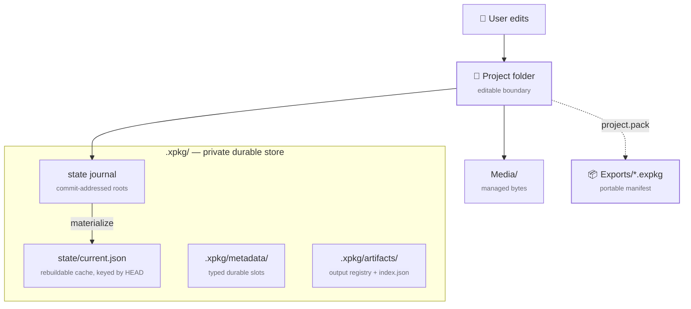

# Storage Direction

xpkg is now project-first in both product language and the normal durable
write path. The editable contract is project folder + private `.xpkg/` state
+ portable `.expkg` export.

!!! info
    Status: current implementation notes. Today the committed source of truth is
    the durable store head under `.xpkg/`. Normal project commits store a
    native state root, while `.xpkg/state/current.json` remains a rebuildable
    cache keyed by the durable commit id.

## Layered storage

## Current truth

Today xpkg has three storage ideas in play:

- project root as the editable project boundary
- `.xpkg/` as the private durable store boundary
- `.expkg` as the portable packed artifact

Normal project save and import flows do not commit archive blobs first. They
commit a project-native state into the durable store, then materialize
`.xpkg/state/current.json` as the local cache for fast reopening.

## Durable Store Contract

The durable store already had the right high-level shape:

- journaled commit boundaries
- immutable content-addressed objects
- commit metadata with generic `roots`
- a stable head commit id for stale-cache protection

The missing cutover was runtime behavior. The store now uses that generic
`roots` capability for normal project heads:

- project-native commits store `roots["state"]`
- commit roots now hydrate through typed `RootEntry` values instead of raw
  root dictionaries
- the embedded `xpkg_commit_id` in `.xpkg/state/current.json` must match the
  durable head before the state cache is trusted

That means the durable head stays authoritative while the cache stays cheap to
rebuild.

Project load/pack/validate flows now also reject a tampered
`.xpkg/state/current.json` cache even when its embedded `xpkg_commit_id`
matches the head. If the cache diverges from the committed state payload,
xpkg rebuilds it from the durable store before continuing.

## Public Cutover Status

The public cleanup now matches that storage model:

- `ProjectService` with `import_pose`/`import_calibration` is the primary downstream path
- `xpkg.project` keeps project lifecycle/import helpers
- package-level `xpkg.adapters` and the CLI `xpkg convert` surface were removed
- compatibility alias maps for direct `.xpkg` archive files were removed from
  the public facades

## Removed Archive Layer

The legacy single-file HDF5 archive engine has been removed from the active IO
surface. Project importers now build project-native labels and metadata
directly, then commit state roots into the private durable store.

Vendor HDF5 readers remain where the source format itself is HDF5, such as DLC
H5, SLEAP analysis H5, Doric containers, and Teleopto H5 exports. Those are
edge input readers, not xpkg project artifacts.

## Recommended Position

xpkg should treat the editable project and `.expkg` export as the only
project artifacts.

That means:

- route new project features through project-native state
- keep `.xpkg/` as a private directory, not a single-file project format
- keep the public storage story centered on project + `.xpkg/` + `.expkg`
- keep vendor HDF5 support scoped to input readers

## Bottom Line

The durable store head is project-native for normal project flows. Direct
HDF5 archive handling is no longer a migration path or a committed storage
contract.
