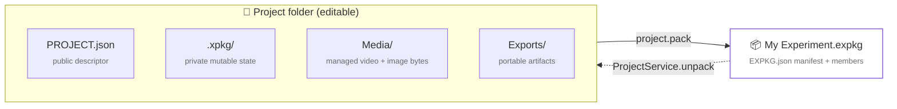
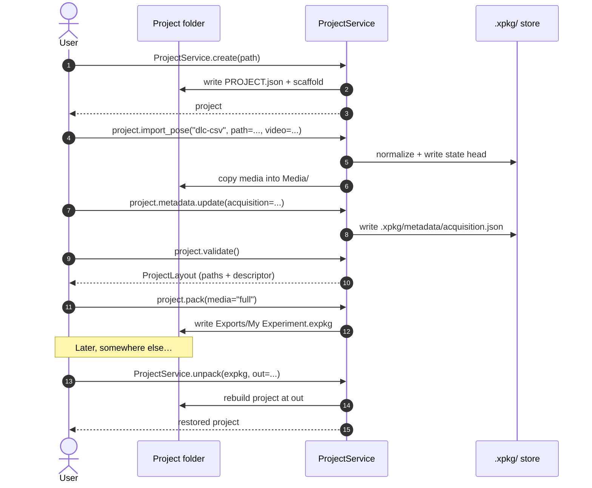

---
hide:
  - toc
  - navigation
---

<div class="xpkg-hero" markdown>

# xpkg

<p class="tagline">
The IO and project boundary for multimodal neuroscience experiments.
Pose, video, sampled signals, behavioral events — one stable contract,
portable artifacts, no analysis platform attached.
</p>

<div class="terminal">
<span class="prompt">$</span> pip install exp-pkg<br>
<span class="prompt">$</span> xpkg project init "./My Experiment"<br>
<span class="prompt">$</span> xpkg import pose dlc-csv --path tracking.csv --video clip.mp4 --out "./My Experiment"
</div>

<div class="actions">
  <a href="getting-started/" class="primary">Get started →</a>
  <a href="api/services/" class="secondary">Service API</a>
  <a href="cli_command_spec_v1/" class="secondary">CLI spec</a>
</div>

</div>

<div class="xpkg-features" markdown>

<div class="feature" markdown>
<span class="label">Service-first</span>
### One object, full lifecycle
`ProjectService` creates, opens, imports into, validates, packs, and unpacks
projects. No surface to memorize beyond the dispatch methods.
</div>

<div class="feature" markdown>
<span class="label">Typed throughout</span>
### From bytes to dataclasses
External pose, motion-capture, and signal formats normalize into typed
`xpkg.model` objects. No untyped dicts crossing the IO boundary.
</div>

<div class="feature" markdown>
<span class="label">Portable</span>
### `.expkg` is the only export
A signed zip with `EXPKG.json` declaring members, sizes, and SHA-256
digests. Three media policies — full, package, manifest — for any size.
</div>

</div>

## Quickstart

```python
from xpkg.services import ProjectService

# Create a project — folder + private .xpkg/ store
project = ProjectService.create("./My Experiment", title="My Experiment")

# Import in one of three families: pose, calibration, motion
project.import_pose("dlc-csv", path="tracking.csv", video="clip.mp4", skeleton_name="subject")

# Attach typed metadata (acquisition, dataset_share, datasheet, model_card)
project.metadata.update(
    acquisition={"acquisition_id": "session-001", "cameras": [{"camera_id": "cam-top", "frame_rate_hz": 120.0}]},
)

# Validate and pack into a portable .expkg
project.validate()
artifact = project.pack()
```

## What you import

<div class="xpkg-cards three" markdown>

<div class="card" markdown>
### Pose
DeepLabCut (CSV / H5 / project), Lightning Pose, SLEAP (analysis H5,
`.pkg.slp`), MMPose top-down JSON, MediaPipe pose-landmarks JSON.
</div>

<div class="card" markdown>
### Motion + force
Vicon CSV and C3D recordings (auto-detect via `import_motion("vicon", ...)`),
plus EMG and force-plate channels read off the same recording.
</div>

<div class="card" markdown>
### Signals + events
Photometry (Doric, Neurophotometrics, pyPhotometry, RWD OFRS, Teleopto, TDT,
pMAT, generic CSV) and event tables, all through `xpkg.readers`.
</div>

</div>

## Pick by task

| You want to… | Reach for |
| --- | --- |
| Create / open / pack / unpack a project | `xpkg.services.ProjectService` |
| Import an external pose, calibration, or motion file | `project.import_pose / import_calibration / import_motion` |
| Attach durable typed metadata to a project | `project.metadata` / `project.metadata.update(...)` |
| Read a single file into typed objects | `xpkg.readers.read_*` |
| Build typed model objects in-memory | `xpkg.model` |
| Convert between arrays / tables / JSON payloads | `xpkg.adapters` |
| Inspect a path before importing | `xpkg.inspection.inspect_path` |
| Drive any of the above from a shell | `xpkg --help` (the CLI mirrors the Python surface) |

## The artifact contract



`.expkg` is the only portable export. xpkg never edits a `.expkg` file in
place — pack to publish, unpack to keep working.

[Read the artifact contract →](artifact_contract_v1.md){ .md-button }
[Read the CLI spec →](cli_command_spec_v1.md){ .md-button }

## Lifecycle



## Where things live

<div class="xpkg-cards two" markdown>

<div class="card" markdown>
### Stable surfaces
- `xpkg.services` — `ProjectService` and accessors
- `xpkg.model` — typed dataclasses (pose, signals, metadata, reporting)
- `xpkg.readers` — single-file readers
- `xpkg.adapters` — in-memory exchange (numpy / pandas / JSON)
- `xpkg.media` — video and image IO with hardware accel detection
- `xpkg.inspection` — `inspect_path()` returning `InspectionReport`
</div>

<div class="card" markdown>
### Path-level seam
- `xpkg.project` — free functions (`init_project`, `pack_project`,
  `validate_project`, the importer free functions, path helpers)

These remain importable for callers that want a function-level seam,
but `ProjectService` is the public path.
</div>

</div>
